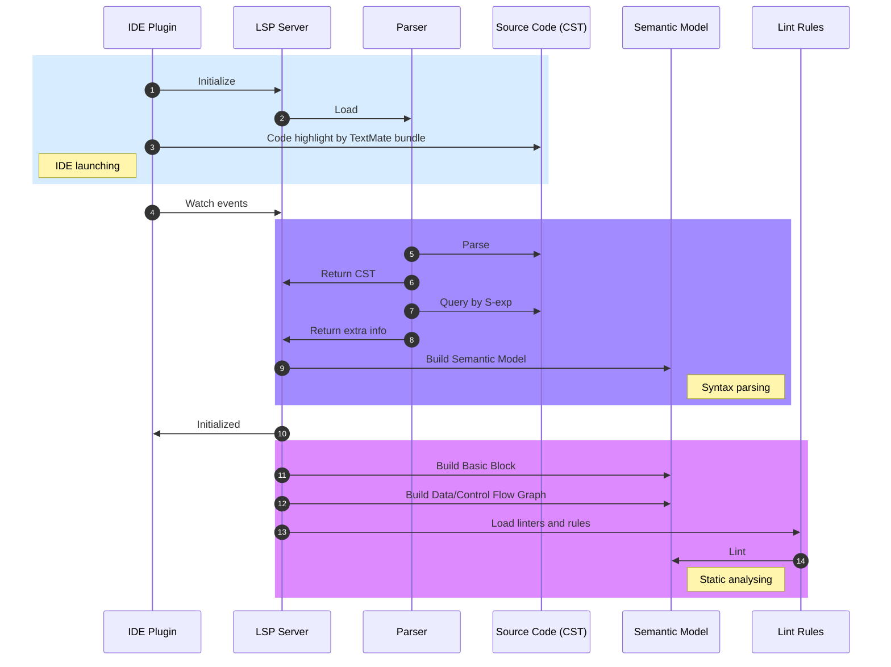

Add compiler toolchain for developers
----
* Author(s): @yufeiminds
* Approver: @coanor
* Status: Working Draft
* Last updated: 2022-11-24
* Discussion at: -

## Abstract

PPL currently supports its own compiler frontend implementation, which is based on the goyacc parser generator to build AST from code. However, the popular tree-sitter is more suitable for IDE integraion and static analysis tools development. In order to converge with this industry trend, PPL will based on the tree-sitter solution to build framework of complier front-end and middle-end. Such as the parser, CST, semantic checker, and so on.

The tree-sitter is a parser generator tool and an incremental parsing library. It can build a concrete syntax tree for a source file and efficiently update the syntax tree as the source file is edited. It can also be used to build code analysis tools.

Tree-sitter is used by many popular programming languages, such as JavaScript, Python, C, C++, Java, Go, PHP, Ruby, C#, Rust, and so on.

We need to add a compiler toolchain for developers to improve the development efficiency of PPL. Include the fowllowing features:

* The language features:
    1. Support for **syntax highlighting**
    2. Support for **code completion**
    3. Support for **code formatting**
    4. Support for **code navigation**
    5. Support for **code refactoring**
* The static analysis:
    1. Support for **code linting**
    2. Support for **vunerability detection**
* The software integration:
    1. Integration to Editor: [VSCode](https://code.visualstudio.com/) / [JetBrains IDE](https://www.jetbrains.com/) / [NeoVim](https://neovim.io/)
    2. Integration to Git provider: [GitHub Linguist](https://github.com/github/linguist)
    3. Integration to Tools: [Prettier](https://prettier.io/)

This proposal is a working draft for adding a compiler toolchain for developers. It will describe the motivation, the design, and the implementation of the compiler toolchain.

## Background

The compiler backend focuses on the compilation of the source code, and the front/middle end focuses on the development of the language toolchain.

Tree-sitter is a modern parsing framework for programming tools. It developed by GitHub and is used to build code analysis tools like syntax highlighting, code completion, code navigation, and refactoring tools. It can also be used to build programming languages and language servers.

The key differences between tree-sitter and other parsing frameworks:

* **Concret syntax tree**: tree-sitter builds a concrete syntax tree (CST) for source code. This is different from an abstract syntax tree (AST), which is a tree representation of the program's abstract syntax. The CST contains all of the source code's tokens, including comments and whitespace. The CST is useful for building tools that need to understand the source code's exact structure, such as syntax highlighting and refactoring tools.
* **Incremental parsing**: tree-sitter can parse a file incrementally, which means that it can re-parse only the changed parts of the file. This is much faster than re-parsing the entire file from scratch.
2. **Sandboxing**: tree-sitter is designed to be safe to run in untrusted environments. It can be used to build code analysis tools that run in editors or other applications.
3. **Error recovery**: tree-sitter can recover from parse errors in a way that is tolerant of syntax errors and edits in progress.

Recently, tree-sitter be used in many projects, such as:

* [Linguist](https://github.com/github/linguist). GitHub use it to detect the language of a source code file. It is used to *generate language statistics* and *highlight code* on GitHub.
* [CodeQL](https://github.com/github/codeql). CodeQL is a static analysis engine for finding security vulnerabilities in your code. It is used to *detect security vulnerabilities* in your code.
* [NeoVim](). NeoVim use it to provide syntax highlighting, code completion, code navigation, and refactoring tools.

## Proposal

### Architecture

In our solution, we will use the tree-sitter to build the compiler toolchain. The typical workflow is as follows:

There are three main components in our solution:

* **Parser**: The parser is the core part of the compiler toolchain, it is used to parse the source code to the concrete syntax tree (CST). It also provider the tree query engine, which is used to query the CST. It use S-expression liked query syntax.
* **IDE Plugin**: The IDE plugin is the client part of the compiler toolchain, which is used to provide the IDE features, it use TextMate bundle to implement token highlight in pure-client side.
* **LSP server**: The LSP server is the server part of the compiler toolchain, it is used to provide the language server protocol, such as code completion, code navigation, code refactoring, and so on. It is also used to provide the static analysis tools, such as code linting, vunerability detection, and so on. The LSP server is a server of the LSP protocol.

### Code highlight

There are two ways to implement the code highlight:

* **Pure-client side**: The IDE plugin use the TextMate bundle to implement the code highlight. The TextMate bundle is a collection of TextMate grammar files, which is used to describe the syntax of a programming language. The TextMate bundle is used to implement the code highlight in the IDE plugin without extra calculation.
* **Server side**: The LSP server use the parser to parse the source code to the CST, and then use the CST to implement the code highlight. The LSP server can provide more accurate code highlight, such as the consistent colorize of the same token related to scopes.

In production pratice, we will use all the ways together. When IDE ready, the IDE plugin will use the TextMate bundle to implement the code highlight in pure-client side. When the LSP server is ready, the IDE plugin will use the LSP server to correct the color with the semantic information.

### Code completion

We build the code completion information in the LSP server. The LSP server will use the parser to parse the source code to the CST, and then use the CST to build the semantic model. The semantic model is used to provide the code completion information.

Semantic model includes:

* **Symbol table**: The symbol table is used to store the symbol information, such as the symbol name, the symbol type, the symbol location, and so on. The symbol table is used to provide the code completion information.
* **Function signatures**: The functions is loaded from the standard library, such as the `grok`, the `use`, and so on. The functions is used to provide the code completion/hover information.

### Code navigation

Because the PPL doesn't have the concept of the function definition, we can't provide the code navigation information. But we can provide the function information for the standard library.

* **Function Call**: hover the function call, we can provide the function information, such as the function name, the function description, the function parameters, and so on.
* **Identifier**: click the identifier, we can jump to the first definition of the identifier.

### Code formatting

CST is the representation of the source code, so we can use the CST to implement the code formatting. The LSP server will use the parser to parse the source code to the CST, and then use the SDT (Syntax-directed translation) method to implement the code formatting.

### Code refactoring

Code refactoring is a very important feature of the IDE. We can use the CST to implement the code refactoring. We only support rename identifier in our plan. The LSP server will walk the CST by S-expression, and rename the identifier to re-build the semantic model.

### Code linting & vunerability detection

Code linting and vunerability detection are both code scanning tools. We implement it based on one of the static analysis engine:

If contributor will create a new linter, they can use one of the methods:

* **Tree query + policy engine**: Tree-sitter provider the tree query engine, It can use S-expression the fetch information from CST. The policy engine is used to implement the linter rules. We can use PPL or OPA(Rego) as the policy engine.
* **CodeQL**: When parsing complete, the LSP server will build the CST by tree-sitter, and based on it. We can build the basic block, the data/control flow graph, and so on. Then we can use the CodeQL to implement the code scanning tools.

We will implement code tree query method first, and then implement the CodeQL method if we have enought time.

## Rationale

### Related Materials

1. [Tree-sitter Homepage](https://tree-sitter.github.io/tree-sitter/)
2. *[Incremental Analysis of Real Programming Languages](http://harmonia.cs.berkeley.edu/papers/twagner-glr.pdf)*
3. *[Error Detection and Recovery in LR Parsers](http://what-when-how.com/compiler-writing/bottom-up-parsing-compiler-writing-part-13/)*

## Implementation

We will use the tree-sitter to build the compiler toolchain for PPL. The following is the implementation plan:

1. Create a shared grammar folder for CST(Concrete Syntax Tree).
2. Create textmate grammar for basiclly *token highlighting* about primitive types and keyword.
2. Implement LSP(Language Server Protocol) with *semantic highlight*, *syntax checking*, *code completion* for PPL.
3. Integrate the LSP to Editor, such as VSCode, JetBrains IDE, NeoVim.
4. Improving the language tools, implement *code linting*, *code formatting*, *vunerability detection* for PPL.
